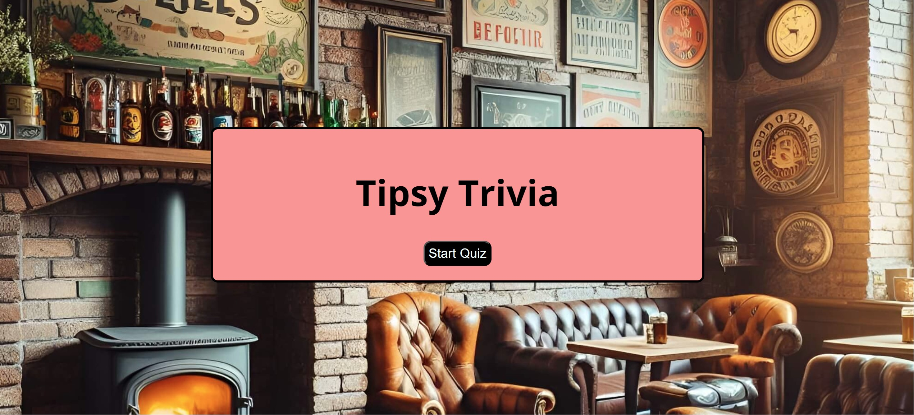
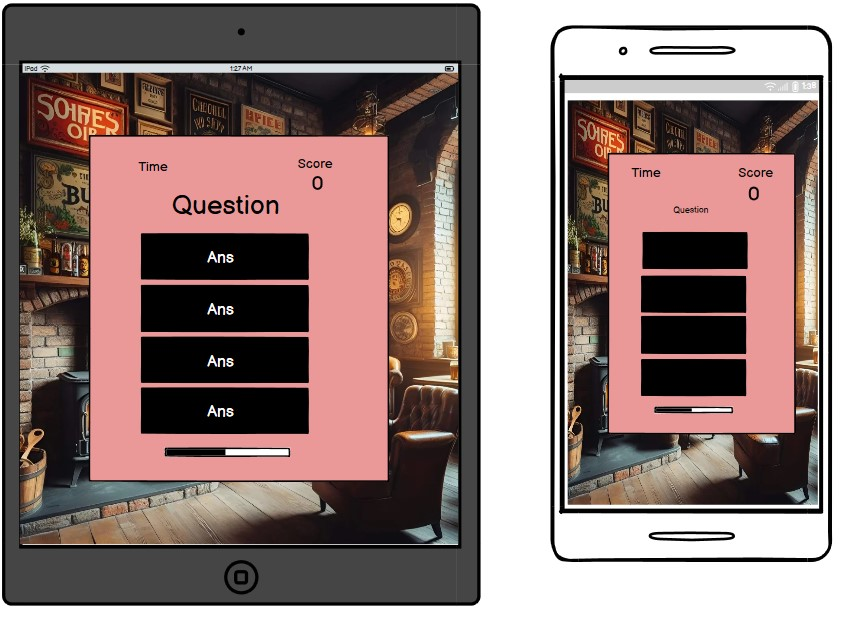

<h1> Tipsy Trivia: The Code Inquiziters Pub Quiz </h1>

[View the live project here] (https://ifzalmalook.github.io/Hackathon2/)

Tipsy Trivia is an interactive website game which is an entertaining general knowledge test exercise. The game is engaging, and is challenging for brain puzzles and information recall to test the audience's general knowledge ability. The site is targeted towards people who are interested in gaming and people who are curious about testing their general knowledge skills. The interactive site has a USP of user friendly design and visuals to make the game accessible to a wide audience. The interactive website is particularly engaging with its use of a game timer, a score counter and clear option choices to encourage and motivate the audience to engage and continue to practice their skills.

## User Experience (UK)

## User Stories

1. As a product owner, I want the game to look attractive in order to make the user return.
2. As a product owner, I want a game with 10 rounds to allow users to test their knowledge.
3. As an owner, I want to provide a general knowledge quiz initially in order to appeal to as many people as possible.
4. As a user I want to be able to easily navigate through the website.
5. As a user I want feedback to know if my answer is correct.
6. As a user I want feedback to know if I have selected an incorrect answer.
7. As a user I want to know my final score once I complete the quiz.
8. As a user, I want to be able to keep track of my score as I go along.
9. As a product owner I want to provide my users with newly generated questions when they revisit the quiz, by using an API, to encourage them to return to my site.
     
## User Stories/Features which could be implemented in the future
1. As a user, I want to be able to compete with others and compare my score on a leaderboard.
2. As a user, I want to have the ability to change number of rounds per game in order to make it more challenging.
3. As a user, I want to have my score saved so I can compare my knowledge from last time.
4. As an owner, eventually I want the user to be able to pick a subject to test in order to further increase the user base.
5. As a user, I want to play against others in order to add to increase the challenge

An option to choose the difficulty of questions generated by the API could also be implemented. Also a modal on the home page to show instructions for the quiz, although it is already fairly intuitive.

## Features and Design

The start page provides a clear theme of pub quiz game, with a warm inviting and interactive content. For ease of use the text is minimal for readability.The background image was selected as a high quality visial and a clear title was added and high quality visuals to draw the eye centrally to invite the audience to proceed. 
    

  

The game has a simple and intuitive layout so users know how to play, there is a question followed by four possible answers. The page also features a home button so users can return to the homepage, as well as a countdown timer, score counter that is updated as they progress through the quiz and a progress bar.

There are 10 questions to progress through. This can be changed in the future by retrieving more questions from the API but it is a good basis to start with, as it is not too long to bore the user and long enough to test their knowledge.

    

The user knows they have selected the correct answer as the background turns green and the incorrect answers turn red.

    

We used an API to generate the questions, to encourage users to return for new questions.

[Link to API site](https://opentdb.com/)

We added a countdown timer which ends the quiz once it goes to 0, this makes the game more exciting and challenging.

The next question populates automatically once the user has answered the current question to make it a quick fire quiz.
    

There is a score counter that updates after each correct answer so the user can keep track of their score.

There is a progress bar on larger screens to show users which question they are currently on and how they are progressing through the quiz

The progress bars becomes a play again button via JavaScript at the end of the quiz to allow users to play again.
    

    
Once the user has answered all the questions or the timer has run out, the end page of the quiz displays their score with the message of "try harder next time" if they score below 6 or "you are a legend" if the score is above 6, this keeps the user motivated to try again
    

There is a html image that acts as a placeholder whilst the questions load as previously there would be text that populated the question container that would show before the questions are generated. 

### Colour Scheme

We used an image of a pub as a background to fit in with the pub quiz theme.
We chose colour scheme red and black to contrast well with the background image

### Typography
Google fonts and font awesome was used to import fonts such as Open Sans, Helvetica and icons for the game page into the html section and styles.css. These were chosen as they work well together and have a simple, user friendly and clear appearance that works well on the tested screen sizes to make sure that is easy to read.

### Wireframes

#### Start Page Wireframes

#### Game Page Wireframes

### Languages Used

- [HTML5](https://en.wikipedia.org/wiki/HTML5)
- [CSS3](https://en.wikipedia.org/wiki/Cascading_Style_Sheets)
- [JS](https://en.wikipedia.org/wiki/JavaScript)
- [Python] (https://en.wikipedia.org/wiki/Python_(programming_language))

### Frameworks, Libraries & Programs Used

-   [Google Fonts:](https://fonts.google.com/) was used to import the 'Open Sans' and 'Helvetica' fonts into the style.css file which are used on all pages of the project.
-   [Font Awesome:](https://fontawesome.com/) was used to add icons for aesthetic and UX purposes.
-   [Git:](https://git-scm.com/) was used for version control by utilising the Gitpod terminal to commit to Git and Push to GitHub.
-   [GitHub:](https://github.com/) is used as the respository for the projects code after being pushed from Git.
-   [Balsamiq:](https://balsamiq.com/) was used to create the wireframes during the design process.

## Testing

### Validator Testing
Automated Testing
[HTML and CSS validations tested on W3C.](https://validator.w3.org/)
[Javascript tested on JShint.](https://jshint.com/) . Only warnings flagged related to ES6, but the code runs well

### Manual Testing was carried out to ensure the quizz code was running smoothly and the buttons and event handlers etc were working.  

### Browser Compatibility

- Testing has been carried out manually on the following browsers :
    - Chrome Version 90.0.4430.212 (Official Build) (64-bit)
    - Mozilla Firefox
    - Microsoft Edge
    

### Test Cases and Results

### Known bugs

Resolved Bugs

We found initially that on play again to reset state function, new questions were not being generated, we found that JavaScript has a built in location.reload() method which we were able to use to overcome this.

There was an encoding issue with some questions generated by the API, where characters would not display properly, this was due to trying to change QuestionElement.innerText initially but was solved by changing the innerHTML for correct encoding

Initially a next button was used to move on to the next question but then a way was found to use the answer divs themselves to trigger the showQuestion function, however initially there was an issue with questions being skipped as the handleNextBtn function was being called twice

There was an issue with being able to select multiple answers but this was solved with an if function to check if accepting answers was true.

## Deployment

The project is deployed to Github pages

[link] (https://ifzalmalook.github.io/Hackathon2/)

## Credits

### Code

- This video helped to inspire the logic for the quiz and the correct/incorrect interactive colouring for the quiz:

[GreatStack - How To Make Quiz App Using JavaScript ](https://www.youtube.com/watch?v=PBcqGxrr9g8&t=1263s)

- This video helped with the code for use of divs as event handlers and to act as next buttons [James J Quick Build a Quiz App (3) - Display Hard Coded Questions] (https://www.youtube.com/watch?v=zZdQGs62cR8&list=PLB6wlEeCDJ5Yyh6P2N6Q_9JijB6v4UejF&index=3)

- This video helped with creating a progress bar [James J Quick Build a Quiz App (6) - Create a Progress Bar] (https://www.youtube.com/watch?v=4bctmtuZVcM&list=PLB6wlEeCDJ5Yyh6P2N6Q_9JijB6v4UejF&index=6)

[Used to help with the Fisher Yates shuffle array function to randomise position of the correct answer from the API] (https://github.com/kera-cudmore/TheQuizArms)

These videos helped with using an API to create a the questions list

[Geek ProbinQuiz App Using Vanilla JavaScript With Open Trivia DB API] (https://www.youtube.com/watch?v=-cX5jnQgqSM&t=34s)

### Content 

- Content on the layout of question answers of the quiz game page was inspired by: [James J Quick Build a Quiz App (2) - Create and Style the Game Page]( https://www.youtube.com/watch?v=IK257Ln0MZc&list=PLB6wlEeCDJ5Yyh6P2N6Q_9JijB6v4UejF&index=2)

-All images are generated by Bing image generator

### Acknowledgments

- We extend our gratitude to our mentor, Iris_ci, Cohort Facilitator and instructors at CodeInstitute for offering invaluable advice and feedback on project planning and execution. Her guidance included ample suggestions for website criteria, software, technology recommendations, coding instructional videos and practice, as well as valuable resources for coding and testing.
