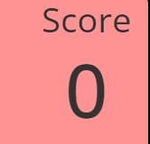

<h1> Tipsy Trivia: The Code Inquiziters Pub Quiz </h1>

[View the live project here] ()

Tipsy Trivia is an interactive website game which is an entertaining general knowledge test exercise. The game is engaging, and is challenging for brain puzzles and information recall to test the audience's general knowledge ability. The site is targeted towards people who are interested in gaming and people who are curious about testing their general knowledge skills. The interactive site has a USP of user friendly design and visuals to make the game accessible to a wide audience. The interactive website is particularly engaging with its use of a game timer, a score counter and clear option choices to encourage and motivate the audience to engage and continue to practice their skills.

![Mockup] ()

## Index – Table of Contents
* [User Experience (UX)](#user-experience-ux) 
* [Features](#features)
* [Design](#design)
* [Testing](#testing)
* [Deployment](#deployment)
* [Credits](#credits)

## User Experience (UK)

-    ## User Stories

    - 1. As a product owner, I want the game to look attractive in order to make the user return.
      2. As a product owner, I want a game with 10 rounds to allow users to test their knowledge.
      3. As an owner, I want to provide a general knowledge quiz initially in order to appeal to as many people as possible.
      4. As a user I want to be able to easily navigate through the website.
      5. As a user I want feedback to know if my answer is correct.
      6. As a user I want feedback to know if I have selected an incorrect answer.
      7. As a user I want to know my final score once I complete the quiz.
      8. As a user, I want to be able to keep track of my score as I go along.
      9. As a product owner I want to provide my users with newly generated questions when they revisit the quiz, by using an API, to encourage them to return to my site.

      ## User Stories/Features which could be implemented in the future
      1. As a user, I want to be able to compete with others and compare my score on a leaderboard.
      2. As a user, I want to have the ability to change number of rounds per game in order to make it more challenging.
      3. As a user, I want to have my score saved so I can compare my knowledge from last time.
      4. As an owner, eventually I want the user to be able to pick a subject to test in order to further increase the user base.
      5. As a user, I want to play against others in order to add to increase the challenge

## Features

### Existing Features

    ____F01 Start Page - 

    

    - The start page provides a clear theme of pub quiz game, with a warm inviting and interactive content. For ease of use the text is minimal for readability.The background image was selected as a high quality visial and a clear title was added and high quality visuals to draw the eye centrally to invite the audience to proceed. 
    

       

    
    *Image of game page design*

    The game has a simple and intuitive layout so users know how to play, there is a question followed by four possible answers.

    *Screenshot of correct answer*

    The user knows they have selected the correct answer as the background turns green.

    *Screenshot of incorrect answer*

    The user is aware of the incorrect answers as the backgrounds turn red.

    We used an API to generate the questions, to encourage users to return for new questions.

    !(https://opentdb.com/)

    

    We added a countdown timer which ends the quiz once it goes to 0, this makes the game more exciting and challenging.

    The next question populates automatically once the user has answered the current question to make it a quick fire quiz.
    
    

    There is a score counter that updates after each correct answer so the user can keep track of their score.

    

    There is a play again created by JavaScript that appears at the end of the quiz to allow users to play again.

    *Loading Placeholder*
    There is a html image that acts as a placeholder whilst the questions load. 

## Design

We used an image of a pub as a background to fit in with the pub quiz theme.

### Imagery

### Colour Scheme

### Typography

### Wireframes

#### Start Page Wireframes

#### Game Page Wireframes

### Languages Used

- [HTML5](https://en.wikipedia.org/wiki/HTML5)
- [CSS3](https://en.wikipedia.org/wiki/Cascading_Style_Sheets)
- [JS](https://en.wikipedia.org/wiki/JavaScript)
- [Python] (https://en.wikipedia.org/wiki/Python_(programming_language))

### Frameworks, Libraries & Programs Used

-   [Google Fonts:](https://fonts.google.com/) was used to import the 'Open Sans' and 'Helvetica' fonts into the style.css file which are used on all pages of the project.
-   [Font Awesome:](https://fontawesome.com/) was used to add icons for aesthetic and UX purposes.
-   [Git:](https://git-scm.com/) was used for version control by utilising the Gitpod terminal to commit to Git and Push to GitHub.
-   [GitHub:](https://github.com/) is used as the respository for the projects code after being pushed from Git.
-   [Balsamiq:](https://balsamiq.com/) was used to create the wireframes during the design process.

## Testing

### Validator Testing

### Browser Compatibility

- Testing has been carried out on the following browsers :
    - Chrome Version 90.0.4430.212 (Official Build) (64-bit)

### Test Cases and Results

### Known bugs

## Deployment

## Credits

### Code

- This video helped to inspire the logic for the quiz and the correct/incorrect interactive colouring for the quiz:

[GreatStack - How To Make Quiz App Using JavaScript ](https://www.youtube.com/watch?v=PBcqGxrr9g8&t=1263s)

- This video helped with the code for use of divs as event handlers and to act as next buttons : [cjphawes / multiple-choice-quiz] (https://github.com/cjphawes/multiple-choice-quiz)

### Content 
- Content on the start page was loosely based on design based on [James Q Quick - Build a Quiz App (1) - Create and Style The Home Page] (https://www.youtube.com/watch?v=rFWbAj40JrQ&t=70s)

- Content on the layout of question answers of the quiz game page was loosely based on: [Jefferson-Bantawig/ QuizTion-quiz-Game](https://github.com/Jefferson-Bantawig/QuizTion-Quiz-Game)

-All images are generated by Bing image generator

### Acknowledgments

- We extend our gratitude to our mentor, Iris_ci, Cohort Facilitator and instructors at CodeInstitute for offering invaluable advice and feedback on project planning and execution. Her guidance included ample suggestions for website criteria, software, technology recommendations, coding instructional videos and practice, as well as valuable resources for coding and testing.